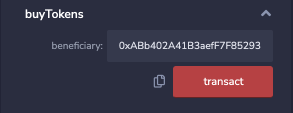

# Kasei Coin

This repo contains the following three Solidity smart contracts:
1. An ERC-20 compliant token called Kasei Coin (KAI).
2. A crowdsale contract from the OpenZeppelin Solidity library that can mint the Kasei Coins.
3. A deployment contract that deploys both the token and and the crowdsale contract.

---

## Technologies

The smart contracts are written in Solidity and compatible with Ethereum-based blockchains.

The contracts were developed and tested using the following tools:
* The OpenZeppelin Solidity library was used to import ERC-20 and crowdsale functionalities. 
* The Ethereum Remix IDE was used to develop, compile, and deploy the code.
* Genache was used to create a local Ethereum blockchain to which the contracts were deployed.
* MetaMask is a digital wallet for Ethereum and was used to link the Remix IDE to the local blockchain.
 * Injected Web3 was used to create a link between Remix and MetaMask.
 * MetaMask was connected to the network created by Genache, and test accounts from Genache were imported into MetaMask.

---

## Evaluation Evidence

Ethereum Remix IDE after compiling KaseiCoin contract:

Ethereum Remix IDE after compiling KaseiCoin crowdsale contract:

Ethereum Remix IDE after compiling KaseiCoin crowdsale deployer contract:

Genache local Ethereum blockchain:

First Genache test account imported into MetaMask:

Second Genache test account imported into MetaMask:

Third Genache test account imported into MetaMask:

Ethereum Remix IDE after deploying KaseiCoin crowdsale deployer contract:

Ethereum Remix IDE showing KaseiCoin contract and KaseiCoin crowdsale contract addresses linked:

Genache local Ethereum blockchain after deployment:

Record of contract creation in Genache

Buying KaseiCoin tokens and sending to second Genache account:

Balance of second Genache account shown in Remix after receiving tokens:

Balance of second Genache account shown in MetaMask after receiving tokens:

Buying KaseiCoin tokens and sending to third Genache account:

Balance of third Genache account shown in Remix after receiving tokens:

Balance of third Genache account shown in MetaMask after receiving tokens:

Total supply of KaseiCoins after sending to second and third Genache accounts:

Total amount of wei raised after sending to second and third Genache accounts:

---

## Contributors

Michael Danenberg

---

## License

MIT